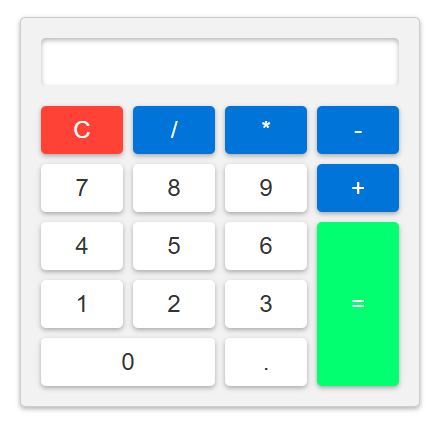

# Basic Calculator

A clean, responsive, and easy-to-use web-based calculator built with HTML, CSS, and vanilla JavaScript. 

**[🎮 Live Demo: Click here to use the app!](https://idhaiis.github.io/Web-Development/Calculator)**

## Preview

## Features
* **Basic Arithmetic Operations:** Supports addition, subtraction, multiplication, and division.
* **Clear Functionality:** Quickly reset your calculations using the red 'C' button.
* **Modern UI Design:** A sleek, user-friendly interface utilizing CSS Grid with distinct color-coded buttons for standard numbers, operators, and actions.
* **Responsive Layout:** Adjusts neatly across different screen sizes.

## Technologies Used
* **HTML5:** Provides the semantic structure of the calculator elements.
* **CSS3:** Handles the styling, layout, shadows, and button aesthetics.
* **JavaScript (Vanilla):** Powers the core mathematical logic, display updates, and button event listeners.

## Getting Started
To run this project locally, no complicated setup or build process is required:
1. Clone this repository or download the project files.
2. Open the `index.html` file directly in any modern web browser.
