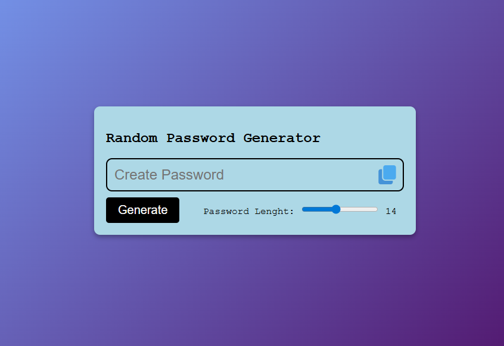
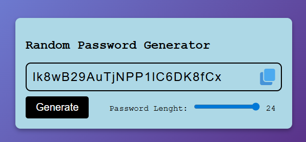
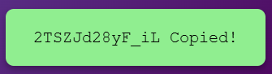

# Random Password Generator

A simple, elegant, and interactive Random Password Generator built with HTML, CSS, and vanilla JavaScript. This tool allows users to quickly generate secure random passwords with customizable lengths and provides a smooth user experience with visual feedback.

## ✨ Features

* **Customizable Length:** Generate passwords anywhere from **6 to 24 characters** using an intuitive range slider.
* **One-Click Copy:** Easily copy the generated password to your clipboard with a single click on the copy icon.
* **Animated Feedback:** A sleek, animated popup notifies you instantly when the password has been successfully copied.
* **Modern UI:** Clean and responsive design featuring a beautiful gradient background and clear typography.

## 🚀 Technologies Used

* **HTML5:** For the semantic structure of the application.
* **CSS3:** For custom styling, layout, gradient backgrounds, and smooth popup animations.
* **JavaScript (Vanilla):** For DOM manipulation, random string generation logic, and Clipboard API integration.

## 📸 Previews

Here is a look at the application in different states:

### Default State


### Password Generated (Max Length: 24)


### Copy Confirmation Popup


## 🛠️ Installation & Usage

Since this is a vanilla frontend project, no special installation, dependencies, or build steps are required.

1. Clone the repository to your local machine:
   ```bash
   git clone https://github.com/Idhaiis/Web-Development/tree/main/RandomPasswordGenerator.git
   ```
2. Navigate to the project directory:
   ```bash
   cd RandomPasswordGenerator
   ```
3. Open the `index.html` file directly in your preferred web browser to start using the generator.
