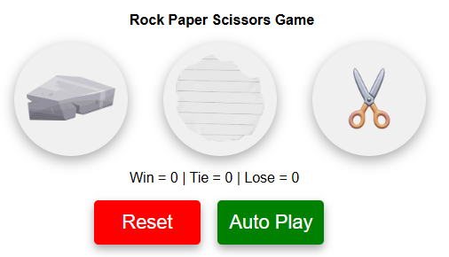
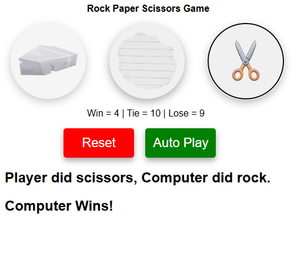
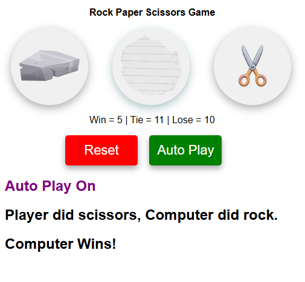

# Rock Paper Scissors Game

A fun, interactive web-based Rock Paper Scissors game where you can play against the computer. It features score tracking and an "Auto Play" mode!

**[🎮 Live Demo: Click here to play the game!](https://idhaiis.github.io/Web-Development/RockPaperScissors)**

## ✨ Features
- **Classic Gameplay:** Choose between Rock, Paper, and Scissors.
- **Score Tracking:** Automatically keeps track of your Wins, Ties, and Losses during the session.
- **Auto Play Mode:** Sit back and let the game play automatically!
- **Reset Score:** Clear your current score and start fresh with the "Reset" button.

## 📸 Previews

### Initial State

### Gameplay in Action

### Auto Play Mode

## 🛠️ Technologies Used
- HTML
- CSS
- JavaScript

## 🚀 How to Run Locally
1. Clone this repository.
2. Open the `index.html` file in your favorite web browser.
3. Enjoy the game!
